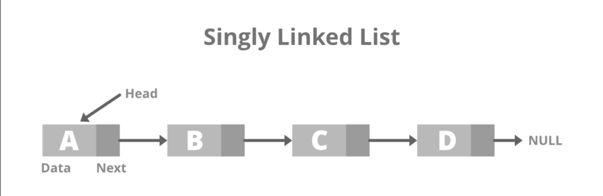

# 💠 Linked List

### 📝 Brief overview

This is a data structure of which the order of its elements are not defined by their physical order in the computer
memory. Instead, each element "points" towards the next one. We call each element a node, as it contains the value it
holds, and a pointer to the next node.

The benefit of this data structure is the speed of which elements are added/removed, as they don't need to be physically
relocated on the computer memory or disk.

On the other hand, as elements are not physically store in order, inserting an element anywhere other than the beginning
of the structure or even the simple act of retrieving an element by its index requires an iteration through most, if
not all, elements of the list.

## ♨️️ Available methods on source code

- ### `size()`

Gets the current amount of elements within the list.

- ### `get(index)`

Gets the element at the specified index.

- ### `insert(index, element)`

Inserts an element at the specified index.

- ### `remove(index)`

Removes the element at the specified index and returns it.

- ### `replace(index, element)`

Replace the element at the specified index and returns it.

- ### `append(element)`

Adds an element to the end of the list.

- ### `prepend(element)`

Adds an element to the beginning of the list.

- ### `removeLast()`

Removes the last element from the list and returns it.

- ### `removeFirst()`

Removes the first element from the list and returns it.

- ### `reverse()`

Reverse the order of the elements of the list. The last element becomes the first, and the first element becomes the
last.